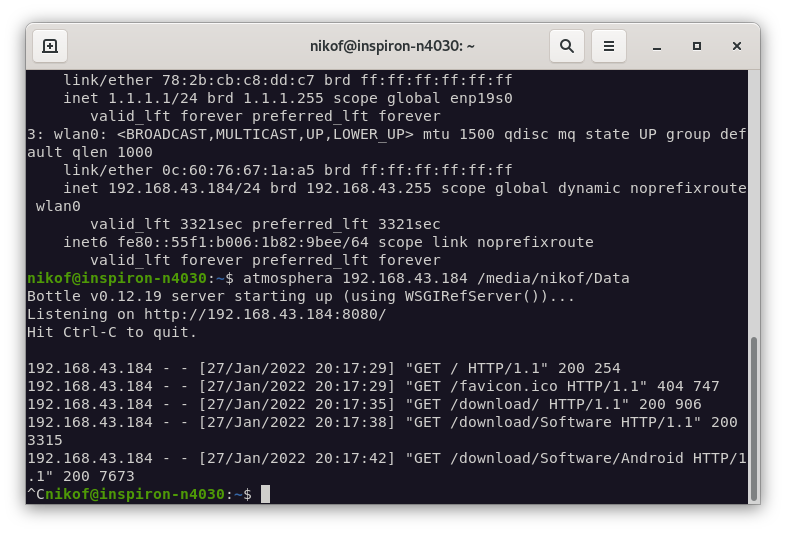

# atmosphera
Tiny file server with the help of <a href="https://bottlepy.org">Bottle</a> web framework.

## How to use?
In order to get it working you just need to execute the routine like: 
- `python3 atmosphera.py IP_ADDRESS ROOT_PATH`
or
- `python3 atmosphera.py IP_ADDRESS` (this will use "~" as `ROOT_PATH`)

## Screenshots

